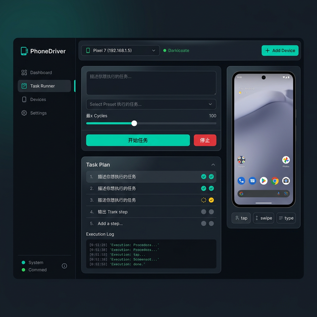

# PhoneDriver

> 本仓库基于上游项目二次开发：<https://github.com/OminousIndustries/PhoneDriver>  
> 当前版本在上游基础上增加了稳定性、可观测性与中文化 Web 控制台能力。

一个基于 Python 的 Android 自动化 Agent：通过 **Qwen3-VL** 理解手机截图，再用 **ADB** 执行动作（tap/swipe/type/system）。

<p align="center">
  
</p>

---

## 功能特性

- 🤖 **视觉驱动自动化**：基于 Qwen3-VL 解析 UI
- 📱 **ADB 控制**：执行点击、滑动、输入、系统按键
- 🖥️ **Web UI**：内置 Gradio，可视化执行任务
- 🔁 **连续任务支持**：可配置持续轮次/时长，避免过早 terminate
- 🧭 **失败反馈闭环（Phase-1）**：失败后自动重截图、分类原因并请求修正动作
- ⚡ **快速截屏 + 回退机制（P0）**：默认 `adb exec-out screencap -p`，失败显式回退 legacy 路径
- 🩺 **启动健康检测（P0）**：自动检测 ADB/设备连接/分辨率，支持 UI 一键刷新
- 📊 **可观测性增强**：记录 retry reason、修正决策、ADB stderr/stdout、截屏路径模式
- 🌲 **任务树可视化（P1）**：展示 phase2 规划步骤与实时步骤状态（pending/running/done/failed）
- 🧩 **预设任务库（P1）**：中文预设任务一键填充输入框，便于快速验证环境

---

## 环境要求

- Python 3.10+
- Android 设备（开启开发者模式与 USB/无线调试）
- ADB（Android Debug Bridge）
- 若使用本地模型：建议具备 GPU 显存

---

## 安装步骤

### 1) 安装 ADB（Ubuntu）

```bash
sudo apt update
sudo apt install -y adb
```

### 2) 克隆仓库并创建虚拟环境

```bash
git clone https://github.com/codesfly/phoneDriver.git
cd phoneDriver
python -m venv .venv
source .venv/bin/activate
```

### 3) 安装依赖

```bash
pip install git+https://github.com/huggingface/transformers
pip install pillow gradio qwen_vl_utils requests torch
```

---

## 设备连接

### USB 连接

```bash
adb devices
```

### 无线调试连接

```bash
adb connect <手机IP:端口>
adb devices -l
```

> 提示：无线调试端口会变化，若连接失败请在手机上刷新后使用新端口。

---

## 快速启动

### Web UI（推荐）

```bash
source .venv/bin/activate
python ui.py
```

打开：`http://localhost:7860`

### 命令行模式

```bash
source .venv/bin/activate
python phone_agent.py "打开 TikTok 并刷一会视频"
```

---

## 配置说明（`config.json`）

常用配置项：

- `device_id`: 设备 ID（如 `192.168.2.192:41527`），为空则自动探测
- `screen_width` / `screen_height`: 分辨率
- `step_delay`: 动作间隔秒数
- `max_retries`: 基础重试上限
- `use_fast_screencap`: 是否启用快速截图主路径（默认 `true`）
- `runtime_config_path`: 运行配置写回路径（用于自动写入分辨率）
- `adb_command_timeout`: 单条 ADB 命令超时（秒）

### 远端 API 模式（推荐）

- `use_remote_api`: `true/false`
- `api_base_url`: OpenAI 兼容接口地址
- `api_key`: API Key
- `api_model`: 例如 `qwen3.5-plus`
- `api_timeout`: API 超时秒数

### 连续任务控制

- `ignore_terminate_for_continuous_tasks`: 连续任务是否忽略早停 terminate
- `continuous_min_cycles`: 连续任务最小轮次
- `continuous_min_minutes`: 连续任务最小时长（分钟）

### 动态重试预算（Phase-1）

- `enable_dynamic_retry_budget`: 是否启用复杂度重试预算
- `retry_budget_simple`: 简单任务预算（默认 2）
- `retry_budget_medium`: 中等任务预算（默认 4）
- `retry_budget_complex`: 复杂任务预算（默认 6）
- `retry_budget_cap`: 预算上限（默认 8）

---

## UI：任务树与预设任务（P1）

### 任务树如何理解

- 在“任务控制”页右侧可看到“任务树 / 规划步骤”面板。
- 该面板展示 phase2 任务分解后的步骤清单：
  - `step_name`：步骤名
  - `instruction`：执行指令
  - `success_criteria`：成功标准
- 状态标识：
  - `⬜ pending`（待执行）
  - `🟡 running`（执行中）
  - `🟢 done`（已完成）
  - `🔴 failed`（失败）
- “当前步骤索引”会随任务执行实时刷新。

### 预设任务如何使用

- 在“任务控制”页选择“预设任务”下拉。
- 选中预设后会自动填充“任务描述”输入框。
- 若选择“（不使用预设）”，保留当前输入，不覆盖文本。
- 预设任务均为通用合规场景，可作为连通性自检起点。

## 工作机制

1. 截图：ADB 获取当前屏幕
2. 视觉分析：Qwen3-VL 识别界面并给出动作
3. 执行动作：tap/swipe/type/wait/system
4. 失败闭环：失败时自动分类原因并请求修正动作
5. 循环执行：直到完成、到达预算、或用户停止

---

## 故障排查

### 1) 设备未连接

```bash
adb kill-server
adb start-server
adb devices -l
```

### 2) 点击位置不准

```bash
adb -s <device_id> shell wm size
```

同步更新 `config.json` 分辨率。

### 3) 模型无动作返回

查看 `phone_agent_ui.log` 是否出现：
- `Remote API empty content`
- `Failed to get action from model`

当前代码已兼容 `tool_calls/content/reasoning_content` 三种形态。

### 4) 任务过早结束

提高：
- `continuous_min_cycles`
- 或 `continuous_min_minutes`

并确认 `ignore_terminate_for_continuous_tasks=true`。

---

## 测试

```bash
source .venv/bin/activate
python -m py_compile phone_agent.py qwen_vl_agent.py ui.py
PYTHONPATH=. python tests/test_phase1_functions.py
PYTHONPATH=. python tests/test_phase1_smoke.py
PYTHONPATH=. python tests/test_p1_functions.py
PYTHONPATH=. python tests/test_p1_ui_smoke.py
```

---

## 提交与文档约定（本仓库）

- 默认使用 **中文 commit message**
- 默认使用 **中文 README/文档**（必要技术术语保留英文）
- 变更提交前至少保证：`py_compile` 通过

---

## 合规与风险提示（Compliance & TOS）

- 移动端自动化可能违反目标平台的 **Terms of Service (TOS)**。
- 本项目仅建议用于：
  - 个人自有设备测试
  - 合法授权场景
  - 合规研发验证
- 禁止用于：
  - 绕过风控/反作弊
  - 设备伪装或对抗性自动化
  - 未授权账号批量操作
- 若平台策略与本项目能力存在冲突，以平台条款和当地法律法规为准。

## License

Apache License 2.0（见 `LICENSE`）

## 致谢

- 上游项目（fork base）：[OminousIndustries/PhoneDriver](https://github.com/OminousIndustries/PhoneDriver)
- [Qwen3-VL](https://github.com/QwenLM/Qwen-VL)
- [Gradio](https://gradio.app/)
